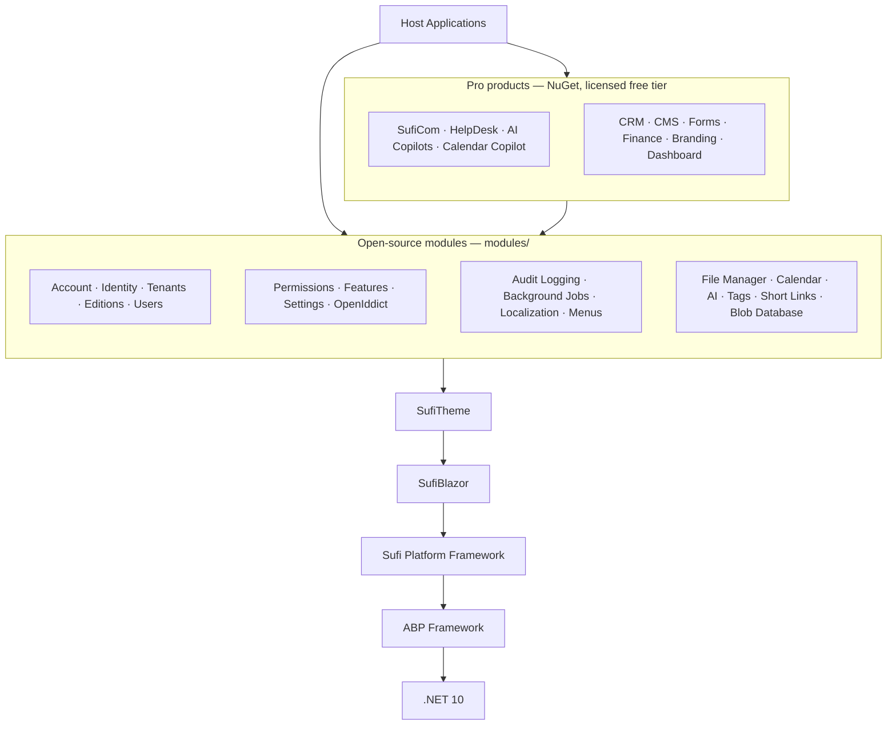

# Sufi Platform


[](https://github.com/sufi-chain/sufi-platform/releases/latest)
[](LICENSE)
[](https://github.com/sufi-chain/sufi-platform/stargazers)
[](https://github.com/sufi-chain/sufi-platform/network/members)
[](https://github.com/sufi-chain/sufi-platform/issues)
[](https://github.com/sufi-chain/sufi-platform/commits)

**Open-source modular platform for multi-tenant Blazor business applications**

Sufi Platform is the LGPL foundation for building enterprise products on [.NET 10](https://dotnet.microsoft.com/) and [ABP Framework](https://abp.io) without rebuilding identity, tenancy, permissions, settings, auditing, localization, files, AI workspaces, or communications for every solution.

It is not an ABP fork. Backend modularity and infrastructure come from ABP NuGet packages. Sufi Platform adds a focused product layer: **~31 value-add framework packages** (`SufiChain.SufiPlatform.*`), **19 first-party modules**, the **`sufi` CLI** and templates, plus two independent UI products — **[SufiBlazor](https://github.com/sufi-chain/sufi-blazor)** (MIT component library, ~90 `Sb*` controls) and **[SufiTheme](https://github.com/sufi-chain/sufi-theme)** (LGPL app shell, DualSidebar / SideMenu / TopMenu layouts). Together they replace Blazorise-based ABP UI with a branded Blazor experience for admin and portal surfaces.

Generated hosts start with account and identity, tenant and edition foundations, feature/permission/setting management, OpenIddict, audit logging, background jobs, file management, calendar, tags, menus, short links, database blob storage, SufiAI workspaces (RAG/MCP), and SufiCom messaging contracts. **Pro** products — SufiCom, HelpDesk, AI Copilots, Calendar Copilot, CRM, CMS, Forms, Branding, Dashboard, and Finance (payments, wallets, invoicing, inventory) — are **not open source**. They ship as **NuGet packages**. Obtain a license at [sufiplatform.com](https://sufiplatform.com) to use them; a **free tier** is available for every licensee.

---

## What is Sufi Platform?

Sufi Platform is an independent platform **on top of** ABP. It extends ABP with Sufi-branded APIs, a custom UI stack, and original modules:

- **Consumes ABP** as NuGet for modular DDD, multi-tenancy, permissions, settings, auditing, and persistence (`Volo.Abp.*` used directly where Sufi adds no behavior)
- **Provides ~31 framework packages** — UI abstractions, DDD bases, authentication, SufiAI, SufiCom, captcha, AspNetCore/MVC, CLI
- **Ships 19 first-party modules** — reimplemented ABP-style modules with Sufi UI, plus Calendar, AI, File Manager, Menus, Tags, Short Links, Editions, and more
- **Uses SufiBlazor + SufiTheme** as the default Blazor component system and application shell (independent products, not Blazorise)
- **Offers the `sufi` CLI** for scaffolding solutions from the unified template
- **Stays open-source** under LGPL-3.0 (SufiBlazor is MIT)

### Architecture Stack



---

## Framework Packages

31 `SufiChain.SufiPlatform.*` packages under `framework/` — each adds real value beyond ABP (UI, branding, AI, communications, captcha, CLI). Thin re-export wrappers were removed as part of Framework Reduction.

| Family | Packages | Description |
|--------|----------|-------------|
| **Core / DDD** | Core, Ddd.Application.Contracts, Ddd.Application | Module base (`SufiModule`), DTO bases, `SufiApplicationService` |
| **UI** | UI.Abstractions, UI.Domain.Shared, UI.Services, UI.Blazor, UI.Blazor.Server, UI.Blazor.WebAssembly | Menu/toolbar/theme contracts, `SufiComponentBase`, localization resources |
| **SufiAI** | SufiAI, SufiAI.Abstractions | Workspace-based AI integration (chat clients, Semantic Kernel, keyed services) |
| **SufiCom** | SufiCom, SufiCom.Abstractions | Email, SMS, voice, channels, notifications |
| **AspNetCore / Auth** | AspNetCore, Mvc, Authentication.Abstractions, Authentication.OpenIdConnect, Authentication.Server, Authentication.WebAssembly, Authorization | `SufiControllerBase`, OIDC, server/WASM auth |
| **Captcha** | Captcha, Captcha.Recaptcha, Captcha.Turnstile | Math captcha, Google reCAPTCHA, Cloudflare Turnstile |
| **Data / Infra** | BlobStoring.S3Provider, Data, Features, Validation, TextTemplating, TextTemplating.Scriban | S3 blob provider, seed helpers, feature flags, templating |
| **CLI** | CLI, CLI.Core | `sufi` global tool, template pipeline, module registry |

Infrastructure packages (EF Core, MongoDB, EventBus, Caching, AutoMapper, etc.) are consumed directly as `Volo.Abp.*` NuGet packages.

---

## Modules

19 first-party modules under `modules/`, each following ABP's layered structure with Sufi Platform UI and branding.

### Reimplemented from ABP

| Module | Folder | Description |
|--------|--------|-------------|
| **Identity** | `identity` | Users, roles, organizational units, security logs, dynamic claims |
| **Account** | `account` | Registration, login, profile, 2FA, captcha, OTP |
| **Tenant Management** | `tenants` | Tenant CRUD, connection strings, database isolation |
| **Permission Management** | `permissions` | Dynamic permission store and API |
| **Setting Management** | `settings` | Hierarchical settings with admin UI (email, timezone, identity) |
| **Feature Management** | `features` | Host/tenant feature flags |
| **Audit Logging** | `audit-logging` | Entity change tracking and audit log viewer |
| **Background Jobs** | `jobs` | Job store, admin UI, retry management |
| **OpenIddict** | `openiddict` | OAuth 2.0 / OpenID Connect application and token management |
| **Users** | `users` | User lookup abstractions and public selector components |

### Sufi Platform Originals

| Module | Folder | Description |
|--------|--------|-------------|
| **AI Management** | `ai` | AI workspaces, RAG with Qdrant/Pgvector, MCP tool registry, usage analytics |
| **Calendar** | `calendar` | Calendars, events, recurrence, availability, free/busy, 12 MCP AI tools |
| **File Manager** | `file-manager` | File/media management with S3, MinIO, FileSystem, Database providers |
| **Menu Management** | `menus` | Dynamic menu CRUD, tree editor, public menu API |
| **Short Links** | `short-links` | URL shortening with click analytics |
| **Tags Management** | `tags` | Tag definitions and tag-to-entity linking |
| **Editions** | `editions` | Plan/edition definitions and entitlement foundations for multi-tenant products |
| **Localization Management** | `localization` | Dynamic localization management and business editor |
| **Blob Storing Database** | `blob-database` | Database-backed blob storage provider (EF Core + MongoDB) |

All modules support both EF Core and MongoDB, use SufiBlazor components, and follow the `SufiComponentBase` / `SufiControllerBase` / Sufi Platform DTO conventions.

---

## Pro Products

Licensed capability packages (**not open source**), distributed as **NuGet**. Free tier via a license from [sufiplatform.com](https://sufiplatform.com).

| Product | Package area | Description |
|---------|--------------|-------------|
| **SufiCom** | `suficom` | Messaging core, real-time Chat, channels (SMS/voice/email providers) |
| **HelpDesk** | `helpdesk` | Projects, Knowledge Base, Ticketing, LiveChat |
| **AI Copilots** | `ai-copilots` | Copilot definitions, runtime orchestration, MCP allowlists |
| **Calendar Copilot** | `calendar-copilot` | Calendar assistant seeded on the Copilots platform |
| **CRM** | `crm` | Contacts, onboarding, customer relationship workflows |
| **CMS** | `cms` | Content types, page builder, themes, publishing, SEO |
| **Forms** | `forms` | Dynamic forms, records, projections, promote workflows |
| **Finance** | `finance` | Payments, wallets, invoicing, currencies, exchange rates, inventory |
| **Branding** | `branding` | Tenant/product branding surfaces |
| **Dashboard** | `dashboard` | Cross-module dashboard tiles and shortcuts |

---

## Core Features

### Backend Infrastructure (from ABP)

- **Modular Architecture**: Build applications from reusable modules with clear boundaries
- **Domain-Driven Design**: Entities, aggregates, repositories, domain services, specifications
- **Multi-Tenancy**: Database-per-tenant or shared database with tenant isolation
- **Authorization**: Permission-based access control with role and user management
- **Localization**: Multi-language support with JSON resource files
- **Auditing**: Automatic tracking of entity changes and user actions
- **Settings & Features**: Hierarchical configuration system (global, tenant, user)
- **Background Jobs**: Async task processing with retry and scheduling
- **Event Bus**: Local and distributed event handling
- **Caching**: Distributed caching with Redis support
- **Validation**: Fluent validation with automatic DTO validation
- **Exception Handling**: Centralized error handling with localized messages

### Frontend (Sufi Platform Custom)

- **SufiBlazor Component Library**: Custom Blazor components (DataGrid, Form, Modal, Tabs, etc.)
- **SufiTheme**: Dual-layout theme system (collapsed/expanded shells) with LTR/RTL support
- **Responsive Design**: Mobile-first layouts with adaptive navigation
- **Theming System**: CSS variables for easy customization
- **Icon System**: Integrated icon library with consistent styling
- **Localization**: Seamless integration with backend localization

### AI Integration

- **SufiAI Framework**: Workspace-based configuration over Microsoft.Extensions.AI + Semantic Kernel
- **Provider Support**: OpenAI, Ollama, and custom OpenAI-compatible endpoints
- **RAG**: Document indexing and semantic search with Qdrant or Pgvector vector stores
- **MCP Tools**: Model Context Protocol tool registry with Semantic Kernel plugin integration
- **Calendar Copilot**: 12 MCP tools for scheduling, availability, and free/busy queries

### Data Access

- **Entity Framework Core**: Full EF Core support with migrations and LINQ queries
- **MongoDB**: Native MongoDB support with repository pattern
- **Dual Database Support**: All modules support both EF Core and MongoDB
- **Repository Pattern**: Generic repositories with async operations
- **Unit of Work**: Automatic transaction management

---

## Technology Stack

### Backend

- **.NET 10.0** and **ASP.NET Core 10.0**
- **Entity Framework Core 10.0** with migrations and LINQ
- **MongoDB Driver** with native repository support
- **OpenIddict** for OAuth 2.0 and OpenID Connect
- **Microsoft.Extensions.AI** + **Semantic Kernel** for AI integration
- **SignalR** for real-time communication
- **Mapperly** for compile-time object mapping
- **Serilog** for structured logging

### Frontend

- **Blazor Server** and **Blazor WebAssembly** support
- **SufiBlazor** custom component library (`Sb*` prefix)
- **SufiTheme** layout and theming system
- **CSS Variables** for dynamic theming
- **LTR/RTL** bidirectional layout support

### Infrastructure

- **Redis** for distributed caching and session storage
- **RabbitMQ** for distributed events
- **MinIO / S3** for object storage
- **Qdrant / Pgvector** for vector search (AI RAG)
- **PostgreSQL / SQL Server / MySQL / SQLite** relational databases
- **MongoDB** NoSQL database

---

## Getting Started

### Prerequisites

- .NET 10.0 SDK
- Node.js 20+ (for frontend tooling)
- Docker (optional, for Redis, RabbitMQ, databases)
- Visual Studio 2026 / VS Code / Rider

### Installation

1. **Install the Sufi Platform CLI:**

   ```bash
   dotnet tool install -g SufiChain.SufiPlatform.Cli
   ```

2. **Create a new application:**

   ```bash
   sufi new MyApp -t app
   ```

   Architecture variants:

   | Variant | CLI flags |
   |---------|-----------|
   | WebApp (all-in-one) | `--solution-kind webapp` |

   Database options: `-d ef` (default) or `-d mongodb`

3. **Run database migrations:**

   ```bash
   cd MyApp/src/MyApp.DbMigrator
   dotnet run
   ```

4. **Run the application:**

   ```bash
   cd ../MyApp.Blazor
   dotnet run
   ```

5. **Open in browser:**

   Navigate to `https://localhost:44300`

   Default credentials: `admin` / `1q2w3E*`

---

## Project Structure

```
sufi-platform/
  framework/        # ~31 SufiChain.SufiPlatform.* packages
  modules/          # 19 first-party modules (short folders)
  templates/        # CLI solution templates
  docs/             # Module and framework documentation
```

---

## Roadmap

Phase 1 (open-source foundation) is in **alpha**. **Phases 2–3 — Pro Products and Finance** are the active development focus.

| Phase | Focus | Status |
|-------|--------|--------|
| 1 | Foundation (identity, tenants, audit, jobs, settings, SufiBlazor, SufiTheme, files, calendar, AI, tags, menus, …) | Alpha |
| 2 | Pro Products (Chat, HelpDesk, messaging, Copilots, CRM, CMS) | **Alpha · active now** |
| 3 | Finance (wallets, invoices, payments, accounting, inventory) | **Alpha · active now** |
| 4 | Commerce (subscriptions, booking, events, channels) | Soon |
| 5 | ERP (workflows, approvals, procurement, projects, documents) | Future |
| 6 | HR (employees, attendance, leave, payroll, org structure) | Future |
| 7 | Scale & Enterprise (microservices, custom apps) | Future |

Full detail: [docs/roadmap.md](docs/roadmap.md).

---

## License

**Open-source base** (this repository — framework, first-party modules, CLI, templates) is **LGPL-3.0**. SufiBlazor is **MIT**; SufiTheme is **LGPL-3.0**.

**Pro products** (SufiCom, HelpDesk, AI Copilots, Calendar Copilot, CRM, CMS, Forms, Branding, Dashboard, Finance, and related packages) are **not open source**. They are distributed only as **NuGet packages**. Anyone can obtain a license from [sufiplatform.com](https://sufiplatform.com) and use the **free tier** of Pro products; paid tiers unlock higher limits and commercial support.

You can use the open-source base in open-source and commercial projects under LGPL terms. Pro usage requires a valid Sufi Platform license.

---

## Community & Support

- **Website**: https://sufiplatform.com
- **Documentation**: https://sufiplatform.com/kb/sufi-platform-docs
- **User Guide**: https://sufiplatform.com/kb/sufi-platform-docs/kb/sufi-platform-user-guide
- **GitHub (Sufi Platform)**: https://github.com/sufi-chain/sufi-platform
- **GitHub (SufiBlazor)**: https://github.com/sufi-chain/sufi-blazor
- **GitHub (SufiTheme)**: https://github.com/sufi-chain/sufi-theme

### Commercial Support

- Priority support via email and chat
- Consulting services for architecture and implementation
- Custom module development
- Training and workshops

---

## Contributing

Sufi Platform is an open-source project and welcomes contributions:

1. Fork the repository
2. Create a feature branch
3. Make your changes
4. Write tests
5. Submit a pull request

---

## Acknowledgments

Sufi Platform is built on top of [ABP Framework](https://abp.io) and would not be possible without the excellent work of the ABP team. We consume ABP as NuGet packages and extend it with our custom UI system, modules, and tooling.

---

**Built with care by the Sufi Chain Team**
