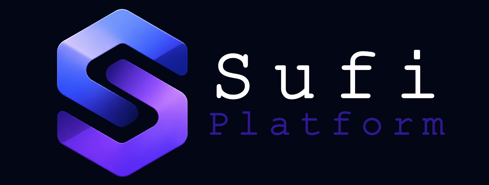

# Sufi Platform Documentation

These docs are written for two groups:

- product owners who want to understand what can be built on the open-source Sufi Platform base and how to describe new product needs clearly
- teams that install the `sufi` CLI, generate a solution, and build a product on top of it

## ABP foundation

Sufi Platform is built on top of the excellent [ABP Framework](https://abp.io), whose source code is available at [github.com/abpframework/abp](https://github.com/abpframework/abp). ABP provides the modular backend architecture and core application patterns; Sufi Platform extends that foundation with Sufi Platform-branded APIs, SufiBlazor, SufiTheme, first-party modules, and the `sufi` CLI.

## Start here

If you are a product owner or planner, begin with:

- [Product Overview](product-overview.md) - understand the platform capabilities and reusable baseline
- [Product Creation Guide](product-creation-guide.md) - turn a product idea into clear modules, workflows, and priorities
- [Module Catalog](modules/index.md) - review the reusable modules already available in the open-source base
- [Roadmap](roadmap.md) - seven product phases (Foundation → Pro → Finance → Commerce → ERP → HR → Scale)

If you are building a product, begin with:

- [Installation](installation.md) - install the CLI and set up the first project
- [Getting Started](getting-started.md) - generate a solution and run it locally
- [Architecture](architecture.md) - see how the layers fit together
- [Module Catalog](modules/index.md) - review the reusable modules

If you are contributing to the platform itself, read:

- Workspace contributor authority at `.obsidian/Docs/Platform Configuration/Contributing and Documentation.md` - work in `sufi-platform/framework/` or `sufi-platform/modules/` and validate through the current development host
- [Framework Overview](framework/overview.md) - navigate the shared framework packages
- [Developer Conventions](framework/developer-conventions.md) - follow the platform rules
- [Architecture decisions](architecture/decisions.md) - accepted framework and module ADRs
- [Operations](operations/runbook.md) - deployment, security, and runbook notes
- [Reference](reference/index.md) - look up settings, permissions, and package relationships

## Terms

| Term | Meaning |
|------|---------|
| **Sufi Platform** | Product and platform name |
| **`SufiChain.SufiPlatform.*`** | Open-source package family under `sufi-platform/` |
| **`Sufi*` types** | Code prefix for framework and module types |
| **ABP Framework** | Upstream foundation that Sufi Platform extends |
| **Pro** | Licensed commercial packages (not open source); free tier via [sufiplatform.com](https://sufiplatform.com) |
